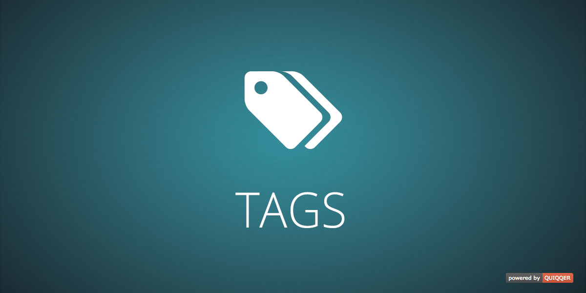

========

The tag package extends QUIQQER with tag-management. 

Tagging allows pages to be grouped into several subject areas at the same time; the rigid hierarchy of conventional categories is thus supplemented or replaced.

Package name:

    quiqqer/tags

Features
--------

- Tag-Management
- Categorize sites with tags
- Search (by) tags
- Lists of tags
- Tag Caching (Cron)

Installation
------------

The package name is: `quiqqer/tags`

Contribute
----------
- Project: https://dev.quiqqer.com/quiqqer/package-tags
- Issue Tracker: https://dev.quiqqer.com/quiqqer/package-tags/issues
- Source Code: https://dev.quiqqer.com/quiqqer/package-tags/tree/master
- Wiki: https://dev.quiqqer.com/quiqqer/package-tags/wikis/home

Support
-------

If you found any flaws, have any wishes or suggestions you can send an email
to [support@pcsg.de](mailto:support@pcsg.de) to inform us about your concerns.  
We will try to respond to your request and forward it to the responsible developer.

License
-------

- GPL-3.0+
